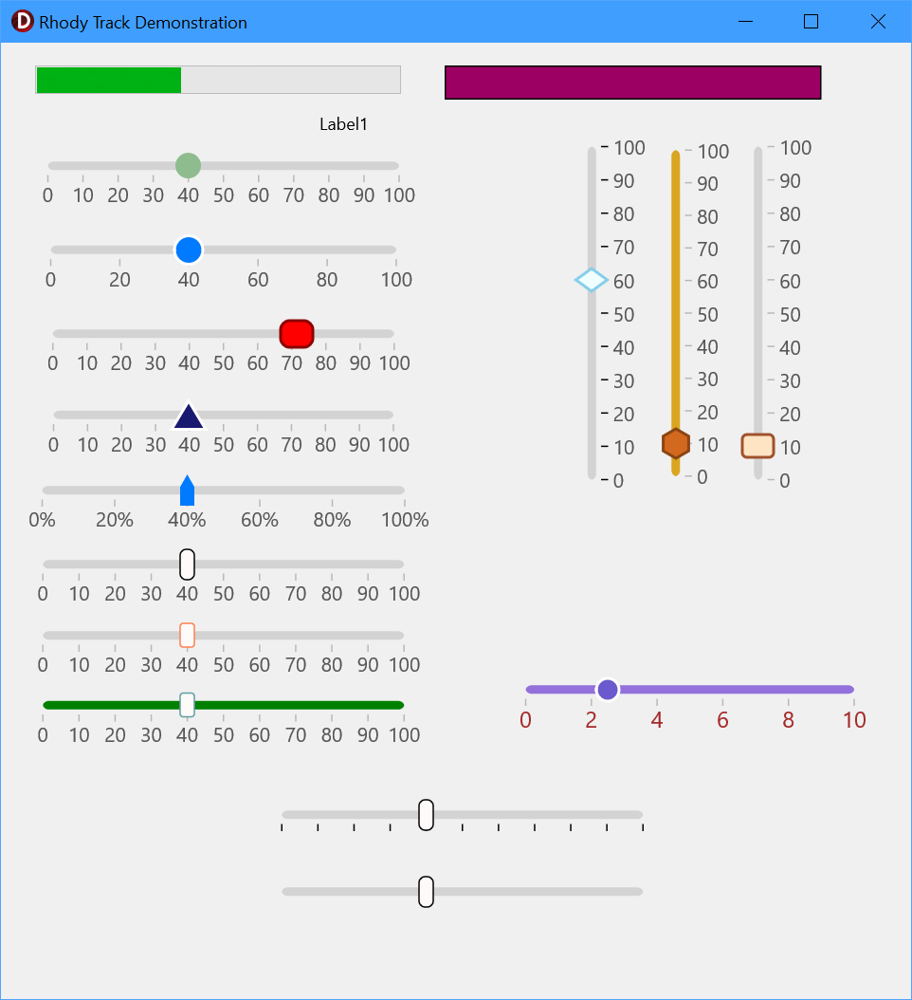

# RhoTrackBar

A modern, fully owner-drawn **FireMonkey (FMX)** trackbar / slider component for
Delphi. `TRhoTrackBar` descends directly from `TControl` and paints its track,
tick marks, value labels and thumb straight onto the canvas — no child controls
are involved.

Registered on the component palette under the **Rhody Controls** category.

---

## Features

- **Horizontal or vertical** orientation (`Orientation`); switching in the IDE
  automatically swaps width/height.
- **Ten selectable thumb shapes** via `ThumbShape`: circle, rectangle, rounded
  rectangle (pill), triangle, inverted triangle, diamond, pentagon, hexagon,
  star and an upward "pointer"/marker.
- **Fully themeable thumb** — fill colour, stroke colour, stroke thickness,
  corner radius, width and height.
- **Tick marks and numeric labels** with configurable frequency, colour, font
  size and an optional value **suffix** (e.g. `"%"`, `" dB"`).
- **Live tracking** toggle — fire `OnChange` continuously while dragging, or
  only once on release.
- **Backward-compatible streaming** — the enum ordering and custom
  `DefineProperties` entries keep older `.fmx` files loading correctly.



---

## Installation

The component lives in a single unit, `Source\uRhoTrackBar.pas`, and ships with
a design-time package.

1. Open **`Packages\RhoFMXTrackbarPackage.dpk`** in RAD Studio.
2. **Build**, then **Install** the package (right-click the package in the
   Project Manager → *Install*).
3. Add the `Source` folder to your project's or IDE's library/search path so
   `uRhoTrackBar` can be found.
4. `TRhoTrackBar` now appears on the **Rhody Controls** tab of the Tool Palette.

The package requires only the standard `rtl` and `fmx` runtime packages.

> Build toolchain: RAD Studio (Delphi) with FireMonkey. Build from the command
> line by sourcing `rsvars.bat` and running `msbuild` on the `.dproj`.

---

## Quick start

Drop a `TRhoTrackBar` onto an FMX form, or create one in code:

```pascal
uses uRhoTrackBar;

var
  Bar: TRhoTrackBar;
begin
  Bar := TRhoTrackBar.Create(Self);
  Bar.Parent := Self;
  Bar.Min := 0;
  Bar.Max := 100;
  Bar.Value := 25;
  Bar.Orientation := TOrientation.Horizontal;
  Bar.ThumbShape := tsCircle;
  Bar.ValueSuffix := '%';
  Bar.OnChange := HandleChange;
end;
```

Reacting to changes:

```pascal
procedure TfrmMain.HandleChange(Sender: TObject);
begin
  ProgressBar1.Value := (Sender as TRhoTrackBar).Value;
end;
```

See **`Demo\TrackBarDemoProject.dpr`** for a full sample form driving a progress
bar and a colour-interpolated rectangle from several trackbars.

---

## Properties

### Value / range

| Property | Type | Default | Description |
|----------|------|---------|-------------|
| `Min` | `Single` | `0` | Minimum value. |
| `Max` | `Single` | `100` | Maximum value. |
| `Value` | `Single` | `0` | Current value; always clamped to `[Min, Max]`. |
| `Orientation` | `TOrientation` | `Horizontal` | Horizontal or vertical layout. |
| `LiveTracking` | `Boolean` | `True` | Fire `OnChange` while dragging (`True`) or only on release (`False`). |

### Ticks & labels

| Property | Type | Default | Description |
|----------|------|---------|-------------|
| `ShowTicks` | `Boolean` | `True` | Draw tick marks along the track. |
| `ShowLabels` | `Boolean` | `True` | Draw numeric labels at each tick. |
| `TickFrequency` | `Single` | `10` | Value interval between ticks. |
| `TickColor` | `TAlphaColor` | `$80808080` | Tick line colour. |
| `LabelColor` | `TAlphaColor` | `$FF555555` | Label text colour. |
| `LabelFontSize` | `Single` | `10` | Label font size. |
| `ValueSuffix` | `string` | `''` | Text appended to each label (e.g. `'%'`). |

### Track & thumb appearance

| Property | Type | Default | Description |
|----------|------|---------|-------------|
| `TrackColor` | `TAlphaColor` | `$FFD3D3D3` | Channel colour. |
| `ThumbShape` | `TThumbShape` | `tsCircle` | Thumb shape (see below). |
| `ThumbWidth` | `Single` | `16` | Thumb width (must be `> 2` and `< Width`). |
| `ThumbHeight` | `Single` | `16` | Thumb height (must be `> 2`). |
| `ThumbFillColor` | `TAlphaColor` | `$FF007AFF` | Thumb fill. |
| `ThumbStrokeColor` | `TAlphaColor` | `$FFFFFFFF` | Thumb border colour. |
| `ThumbStrokeThickness` | `Single` | `2` | Border thickness (`0` = no border). |
| `ThumbCornerRadius` | `Single` | `4` | Corner radius for `tsRectangle`. |

`TThumbShape` values:

```
tsCircle, tsRectangle, tsRoundRect, tsTriangle, tsInvertedTriangle,
tsDiamond, tsPentagon, tsHexagon, tsStar, tsPointer
```

> Note: `tsRectangle` honours `ThumbCornerRadius` (0 gives sharp corners), while
> `tsRoundRect` is always a rounded "pill" independent of the radius.

Standard inherited FMX properties are also published (`Align`, `Anchors`,
`Position`, `Size`, `Margins`, `Padding`, `Opacity`, `Visible`, `Enabled`,
`RotationAngle`, `Hint`, `Cursor`, etc.).

---

## Events

| Event | Description |
|-------|-------------|
| `OnChange` | Fired when `Value` changes. During a drag this fires continuously if `LiveTracking = True`, or only once on mouse-up if `False`. Also fires when `Value` is set programmatically. |
| `OnTracking` | Notify hook exposed for pointer-tracking use. |

Standard FMX mouse, drag and paint events (`OnMouseDown`, `OnMouseMove`,
`OnMouseUp`, `OnMouseWheel`, `OnClick`, `OnPaint`, `OnResize`, …) are published
as well.

---

## How it works

- **`Paint`** draws the track, then tick marks (if `ShowTicks`), then the thumb
  on top — everything on this control's own canvas.
- **`Resize`** recomputes the track rectangle and re-centres the thumb; the
  track ends are inset by half the thumb so it never overhangs at `Min`/`Max`.
- **Thumb geometry** is rebuilt each paint as a `TPathData` in absolute control
  coordinates, snapped to the device-pixel grid for crisp edges under scaling.
- **Mouse handling** captures the pointer on `MouseDown`, maps coordinates to a
  value in `CalculateValueFromCoords`, and releases capture on `MouseUp`.

---

## Project layout

```
Source\      uRhoTrackBar.pas        the component (single unit)
Packages\    RhoFMXTrackbarPackage   design-time package (.dpk/.dproj)
Demo\        TrackBarDemoProject     sample FMX application
```

---

## License

MIT
